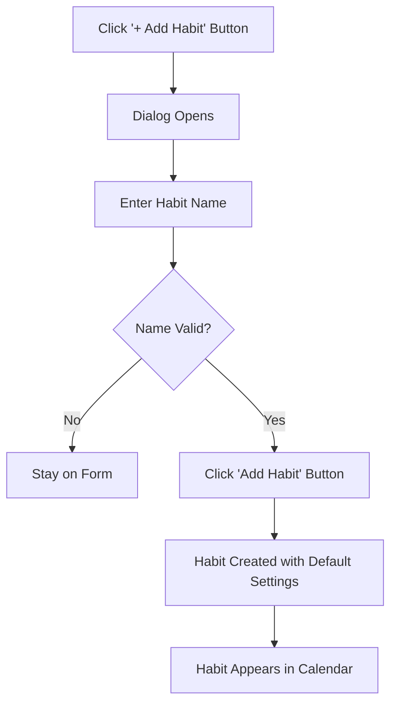
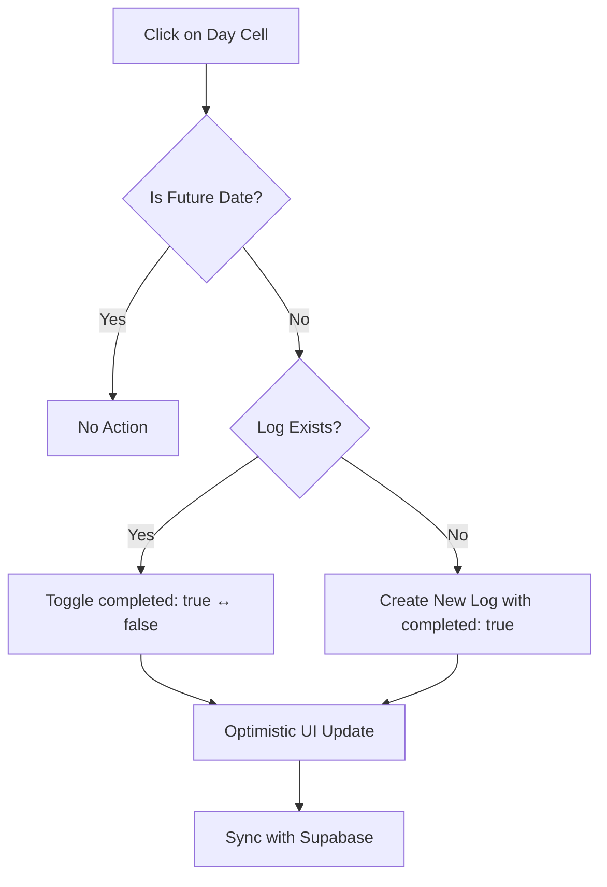
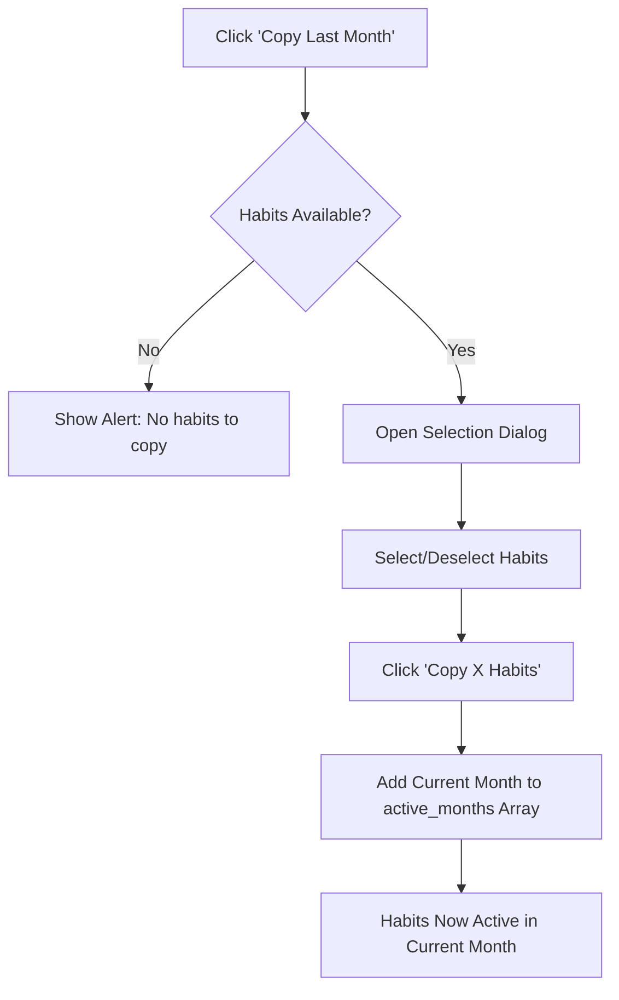
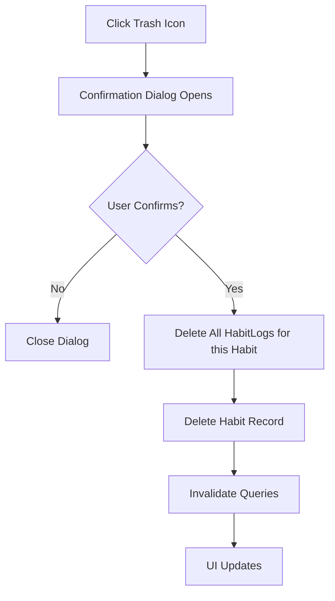

# 📅 Habit Tracker - Complete Documentation

> **Version:** 1.0.0  
> **Last Updated:** December 29, 2025  
> **Module:** Habit Tracker (Excluding Mood Tracker)

---

## 📋 Table of Contents

1. [Overview](#overview)
2. [Features Summary](#features-summary)
3. [UI Components & Layout](#ui-components--layout)
4. [User Workflows](#user-workflows)
5. [Data Architecture](#data-architecture)
6. [Component Deep Dive](#component-deep-dive)
7. [State Management](#state-management)
8. [Mobile Adaptation Guide](#mobile-adaptation-guide)

---

## Overview

The **Habit Tracker** is a powerful module within Tracker Hub designed to help users build and maintain consistent daily habits. It provides a visual calendar-based interface for tracking habit completions, progress analytics, and yearly statistics.

### Key Capabilities
- ✅ Create and manage unlimited habits
- 📅 Monthly calendar view with day-by-day tracking
- 📊 Real-time progress statistics and charts
- 📈 Yearly trend analysis across all months
- 🔄 Copy habits from previous months (rollover feature)
- 🗑️ Safe habit deletion with confirmation
- 🌐 Multi-language support (6 languages)
- 🌙 Dark mode support

---

## Features Summary

| Feature | Description |
|---------|-------------|
| **Add Habit** | Create new habits with a name, auto-assigned to current month |
| **Toggle Completion** | Click any day cell to mark habit as completed/incomplete |
| **Monthly Navigation** | Navigate between months using arrow buttons |
| **Copy Last Month** | Rollover active habits from previous month to current |
| **Delete Habit** | Remove habits permanently with all associated logs |
| **Progress Tracking** | Real-time calculation of completion percentages |
| **Yearly View** | Toggle to see annual progress trends and statistics |
| **Auto-scroll to Today** | Calendar auto-scrolls to highlight current day |

---

## UI Components & Layout

### Page Structure (Desktop)

```
┌─────────────────────────────────────────────────────────────────────┐
│                           HEADER                                      │
│  ┌─────────────────────────────────┐  ┌─────────────┐ ┌────────────┐ │
│  │ 📊 Habits                        │  │ Yearly Stats│ │ + Add Habit│ │
│  │    Track your daily consistency  │  └─────────────┘ └────────────┘ │
│  └─────────────────────────────────┘                                  │
├─────────────────────────────────────────────────────────────────────┤
│                      MONTH NAVIGATION + STATS                        │
│  ┌────┐ ┌────────────────────┐ ┌────┐        ┌─────────────────────┐ │
│  │ ◀  │ │   December 2025    │ │ ▶  │        │ 📋 Copy Last Month │ │
│  └────┘ └────────────────────┘ └────┘        └─────────────────────┘ │
│                                                                       │
│  ┌─────────────────┐ ┌─────────────────┐ ┌─────────────────┐         │
│  │ 🎯 Number of    │ │ 📈 Completed    │ │ 📊 Progress     │         │
│  │    Habits       │ │    Today        │ │    XX.XX%       │         │
│  │      5          │ │      3          │ │    ██████░░░    │         │
│  └─────────────────┘ └─────────────────┘ └─────────────────┘         │
├─────────────────────────────────────────────────────────────────────┤
│                      HABIT CALENDAR GRID                             │
│  ┌──────────┬────┬────┬────┬────┬────┬────┬────┬─────────────┬─────┐ │
│  │ Habit    │ Su │ Mo │ Tu │ We │ Th │ Fr │ Sa │  Analysis   │ 🗑️ │ │
│  │          │ 1  │ 2  │ 3  │ 4  │ 5  │ 6  │ 7  │ Goal/Actual │     │ │
│  ├──────────┼────┼────┼────┼────┼────┼────┼────┼─────────────┼─────┤ │
│  │ ✓ Read   │ ✅ │ ✅ │ ⬜ │ ✅ │ ⬜ │ ✅ │ ⬜ │ 30 / 15 50% │ 🗑️ │ │
│  │ ✓ Exercise│ ✅ │ ⬜ │ ✅ │ ⬜ │ ✅ │ ⬜ │ ✅ │ 30 / 12 40% │ 🗑️ │ │
│  │ ✓ Meditate│ ⬜ │ ✅ │ ✅ │ ✅ │ ✅ │ ✅ │ ✅ │ 30 / 20 67% │ 🗑️ │ │
│  └──────────┴────┴────┴────┴────┴────┴────┴────┴─────────────┴─────┘ │
├─────────────────────────────────────────────────────────────────────┤
│                      PROGRESS CHART                                   │
│  ┌───────────────────────────────────────────────────────────────┐   │
│  │ 📈 Progress Over Time                                          │   │
│  │     100% ┤                                                     │   │
│  │      75% ┤        ╭──╮    ╭─                                   │   │
│  │      50% ┤   ╭────╯  ╰────╯                                    │   │
│  │      25% ┤───╯                                                 │   │
│  │       0% ┼─────────────────────────────────────────            │   │
│  │          1   5   10   15   20   25   30                        │   │
│  └───────────────────────────────────────────────────────────────┘   │
└─────────────────────────────────────────────────────────────────────┘
```

### Visual Elements

#### 1. Header Section
- **Title**: "Habits" with subtitle "Track your daily consistency"
- **Toggle Button**: Switch between Monthly/Yearly view
- **Add Button**: Orange accent button with "+" icon

#### 2. Month Navigation Bar
- **Left/Right Arrows**: Circular buttons for month navigation
- **Month Display**: "Month Year" format (e.g., "December 2025")
- **Copy Button**: Copies habits from previous month

#### 3. Statistics Cards (3-Column Grid)
| Card | Color | Content |
|------|-------|---------|
| **Number of Habits** | Orange Gradient | Total active habits for the month |
| **Completed Today** | White/Dark | Count of habits completed today |
| **Progress** | White/Dark | Overall completion percentage with progress bar |

#### 4. Habit Calendar Grid
- **Sticky Column**: Habit name with icon (always visible during scroll)
- **Day Columns**: Each day of the month with completion checkboxes
- **Analysis Column**: Goal, Actual completed, Progress bar with percentage
- **Delete Column**: Trash icon for each habit

#### 5. Cell States
| State | Visual | Description |
|-------|--------|-------------|
| **Completed** | 🟢 Green checkbox with ✓ | Habit done for that day |
| **Not Completed (Past)** | 🔴 Red border box | Missed habit |
| **Not Completed (Today)** | ⚪ Gray border box | Can still be completed |
| **Future Date** | ⚫ Disabled/faded box | Cannot be clicked |
| **Today Highlight** | 🔵 Blue background | Current day with breathing animation |

---

## User Workflows

### 1. Adding a New Habit



**Default Values for New Habit:**
```javascript
{
  name: "User entered name",
  icon: "✓",
  target_value: 30,
  unit: "days",
  frequency: "daily",
  color: "#ff6b35",
  active_months: ["YYYY-MM"] // Current month key
}
```

### 2. Toggling a Habit Completion



### 3. Copying Habits from Previous Month



### 4. Deleting a Habit



---

## Data Architecture

### Database Tables (Supabase)

#### `habits` Table

| Column | Type | Description |
|--------|------|-------------|
| `id` | UUID | Primary key, auto-generated |
| `user_id` | UUID | Reference to auth.users |
| `name` | TEXT | Habit name (e.g., "Read 30 mins") |
| `description` | TEXT | Optional description |
| `frequency` | TEXT | Tracking frequency (default: "daily") |
| `target_count` | INTEGER | Target completions |
| `color` | TEXT | Hex color code |
| `icon` | TEXT | Emoji icon |
| `is_archived` | BOOLEAN | Soft delete flag |
| `active_months` | TEXT[] | Array of "YYYY-MM" month keys |
| `created_at` | TIMESTAMP | Record creation time |

#### `habit_logs` Table

| Column | Type | Description |
|--------|------|-------------|
| `id` | UUID | Primary key |
| `user_id` | UUID | Reference to auth.users |
| `habit_id` | UUID | Reference to habits.id |
| `date` | DATE | Log date (YYYY-MM-DD) |
| `completed` | BOOLEAN | Completion status |
| `count` | INTEGER | Completion count (for multi-count habits) |
| `notes` | TEXT | Optional notes |
| `created_at` | TIMESTAMP | Record creation time |

### Data Flow Diagram

```
┌─────────────────┐     ┌──────────────────┐     ┌─────────────────┐
│   React Query   │────▶│  base44 Client   │────▶│    Supabase     │
│  (Cache Layer)  │◀────│   (API Layer)    │◀────│   (Database)    │
└─────────────────┘     └──────────────────┘     └─────────────────┘
        │                        │                        │
        │                        │                        │
        ▼                        ▼                        ▼
   Optimistic         User ID Injection           Row Level
    Updates               + Auth                   Security
```

### Data Transformation

**Raw Logs Array → Processed Logs Map:**

```javascript
// Input: Array from Supabase
[
  { id: "abc", habit_id: "h1", date: "2025-12-01", completed: true },
  { id: "def", habit_id: "h2", date: "2025-12-01", completed: false },
  { id: "ghi", habit_id: "h1", date: "2025-12-02", completed: true }
]

// Output: Transformed Map
{
  "2025-12-01": {
    "h1": { completed: true, id: "abc" },
    "h2": { completed: false, id: "def" }
  },
  "2025-12-02": {
    "h1": { completed: true, id: "ghi" }
  }
}
```

---

## Component Deep Dive

### 1. `Habits.jsx` (Main Page - 645 lines)

**Responsibilities:**
- State management for current month, dialogs, mutations
- Data fetching (habits, habit logs)
- Rendering header, stats cards, calendar, and charts
- Handling all CRUD operations

**Key State Variables:**
```javascript
const [currentMonth, setCurrentMonth] = useState(new Date());
const [showYearly, setShowYearly] = useState(false);
const [isAddHabitOpen, setIsAddHabitOpen] = useState(false);
const [habitToDelete, setHabitToDelete] = useState(null);
const [isCopyDialogOpen, setIsCopyDialogOpen] = useState(false);
```

**Key Computed Values:**
```javascript
// Current month key (e.g., "2025-12")
const currentMonthKey = `${year}-${String(month + 1).padStart(2, '0')}`;

// Habits active in current month
const currentMonthHabits = habits.filter(h => 
  !h.active_months || h.active_months.includes(currentMonthKey)
);

// Monthly statistics
const monthlyStats = {
  totalHabits: currentMonthHabits.length,
  totalCompleted: /* sum of all completions */,
  todaysCompletedHabits: /* habits done today */,
  progressPercent: /* (completed / possible) * 100 */
};
```

### 2. `HabitCalendar.jsx` (249 lines)

**Responsibilities:**
- Render the calendar grid with all days of the month
- Display habit rows with completion checkboxes
- Handle click-to-toggle functionality
- Show progress bars and analysis columns
- Auto-scroll to today's date

**Key Features:**
```javascript
// Auto-scroll to today on mount
useEffect(() => {
  if (isCurrentMonth && todayRef.current) {
    container.scrollTo({
      left: scrollLeft,
      behavior: 'smooth'
    });
  }
}, [isCurrentMonth, currentMonth]);

// Progress color logic
const getProgressColor = (percent) => {
  if (percent >= 80) return 'green';
  if (percent >= 50) return 'yellow';
  return 'red';
};
```

### 3. `ProgressChart.jsx` (86 lines)

**Responsibilities:**
- Render an area chart showing daily completion rates
- Calculate completion percentage for each day
- Use Recharts library for visualization

**Chart Configuration:**
```javascript
<AreaChart data={chartData}>
  <Area
    type="monotone"
    dataKey="completion"
    stroke="#10b981"
    fill="url(#colorCompletion)"
  />
  <XAxis dataKey="day" />
  <YAxis domain={[0, 100]} />
  <Tooltip formatter={(value) => `${value}%`} />
</AreaChart>
```

### 4. `YearlyStats.jsx` (158 lines)

**Responsibilities:**
- Show yearly progress trend chart
- Display monthly summary cards (12 cards)
- Calculate progress for each month considering active habits

**Yearly Data Calculation:**
```javascript
const yearlyData = months.map((month, index) => {
  const monthKey = `${year}-${String(index + 1).padStart(2, '0')}`;
  const activeHabits = habits.filter(h => 
    !h.active_months || h.active_months.includes(monthKey)
  );
  
  // Calculate completions for this month
  return {
    month: 'Jan', // etc.
    completed: fullyCompletedHabits,
    progress: percentage,
    habits: activeHabits.length
  };
});
```

---

## State Management

### React Query Configuration

```javascript
// Fetch all habits
const { data: habits = [] } = useQuery({
  queryKey: ['habits'],
  queryFn: () => base44.entities.Habit.list(),
});

// Fetch habit logs for date range
const { data: logsList = [] } = useQuery({
  queryKey: ['habitLogs', monthKey],
  queryFn: () => base44.entities.HabitLog.select({
    buildQuery: (q) => q.gte('date', start).lte('date', end)
  }),
  keepPreviousData: true,
});
```

### Optimistic Updates

The toggle mutation uses optimistic updates for instant UI feedback:

```javascript
const toggleHabitMutation = useMutation({
  mutationFn: async ({ habitId, date, currentCompleted, existingLogId }) => {
    // Update or create log in database
  },
  onMutate: async (variables) => {
    // Cancel outgoing refetches
    await queryClient.cancelQueries({ queryKey: ['habitLogs'] });
    
    // Snapshot previous value
    const previousLogs = queryClient.getQueryData(['habitLogs', key]);
    
    // Optimistically update cache
    queryClient.setQueryData(['habitLogs', key], (old) => {
      // Toggle or add the log
      return updatedLogs;
    });
    
    return { previousLogs };
  },
  onError: (err, variables, context) => {
    // Rollback on error
    queryClient.setQueryData(['habitLogs', key], context.previousLogs);
  },
  onSettled: () => {
    // Refetch to sync with server
    queryClient.invalidateQueries({ queryKey: ['habitLogs'] });
  }
});
```

---

## Mobile Adaptation Guide

### Current Responsive Behavior

The existing implementation has **partial mobile support**:
- ✅ Responsive grid layouts (`grid-cols-1 md:grid-cols-3`)
- ✅ Collapsible text (`hidden sm:inline`)
- ✅ Sticky habit name column
- ⚠️ Calendar still requires horizontal scroll

### Recommended Mobile Adaptations

#### 1. Layout Changes

```
DESKTOP:                           MOBILE:
┌────────────────────────┐         ┌────────────────────────┐
│ Header + Buttons       │         │ Header                 │
├────────────────────────┤         ├────────────────────────┤
│ Stats Cards (3-col)    │         │ Stats Cards (Stack)    │
├────────────────────────┤         │   Card 1               │
│ Calendar Grid          │         │   Card 2               │
│ (horizontal scroll)    │         │   Card 3               │
├────────────────────────┤         ├────────────────────────┤
│ Chart | Mood Tracker   │         │ Today's Habits List    │
└────────────────────────┘         │   □ Habit 1            │
                                   │   ☑ Habit 2            │
                                   │   □ Habit 3            │
                                   ├────────────────────────┤
                                   │ Progress Chart         │
                                   ├────────────────────────┤
                                   │ View Full Calendar →   │
                                   └────────────────────────┘
```

#### 2. Touch-Friendly Controls

**Recommended Changes:**
```css
/* Increase touch target sizes */
.habit-checkbox {
  min-width: 44px;   /* Was 24px */
  min-height: 44px;  /* Was 24px */
}

/* Larger tap areas for navigation */
.nav-button {
  padding: 12px 16px;  /* Was 8px */
}

/* Swipe-friendly month navigation */
.month-container {
  touch-action: pan-x;
}
```

#### 3. Mobile-First Component: Quick Daily View

**New Component Concept: `TodayHabits.jsx`**

```jsx
// For mobile: Show today's habits as a simple checklist
function TodayHabits({ habits, habitLogs, onToggle }) {
  const today = new Date().toISOString().split('T')[0];
  
  return (
    <div className="space-y-3 p-4">
      <h2 className="text-xl font-bold">Today's Habits</h2>
      {habits.map(habit => {
        const isCompleted = habitLogs[today]?.[habit.id]?.completed;
        return (
          <div 
            key={habit.id}
            onClick={() => onToggle(habit.id, today)}
            className={`
              flex items-center gap-4 p-4 rounded-xl
              ${isCompleted ? 'bg-green-100' : 'bg-gray-100'}
              active:scale-95 transition-transform
            `}
          >
            <div className={`
              w-10 h-10 rounded-full flex items-center justify-center
              ${isCompleted ? 'bg-green-500 text-white' : 'border-2 border-gray-300'}
            `}>
              {isCompleted && <Check className="w-6 h-6" />}
            </div>
            <span className="text-lg font-medium">{habit.name}</span>
          </div>
        );
      })}
    </div>
  );
}
```

#### 4. Bottom Sheet Calendar

**Replace full calendar with bottom sheet:**

```jsx
// Mobile bottom sheet for full calendar access
function CalendarBottomSheet({ isOpen, onClose, ...calendarProps }) {
  return (
    <div className={`
      fixed inset-x-0 bottom-0 z-50
      transform transition-transform duration-300
      ${isOpen ? 'translate-y-0' : 'translate-y-full'}
    `}>
      <div className="bg-white dark:bg-gray-800 rounded-t-3xl max-h-[80vh] overflow-auto">
        <div className="w-12 h-1.5 bg-gray-300 rounded-full mx-auto my-3" />
        <HabitCalendar {...calendarProps} />
      </div>
    </div>
  );
}
```

#### 5. Gesture Support

**Swipe Navigation:**
```javascript
// Add swipe gesture for month navigation
import { useSwipeable } from 'react-swipeable';

const handlers = useSwipeable({
  onSwipedLeft: () => navigateMonth(1),   // Next month
  onSwipedRight: () => navigateMonth(-1), // Previous month
  preventDefaultTouchmoveEvent: true,
});

return <div {...handlers}>{/* Calendar content */}</div>;
```

#### 6. Mobile CSS Breakpoints

```css
/* Mobile-first responsive styles */

/* Base mobile styles */
.habits-page {
  padding: 16px;
}

.stats-grid {
  display: flex;
  flex-direction: column;
  gap: 12px;
}

.calendar-grid {
  display: none; /* Hide on mobile by default */
}

.today-checklist {
  display: block;
}

/* Tablet and up (640px+) */
@media (min-width: 640px) {
  .stats-grid {
    flex-direction: row;
  }
}

/* Desktop (1024px+) */
@media (min-width: 1024px) {
  .habits-page {
    padding: 32px;
    max-width: 1280px;
    margin: 0 auto;
  }
  
  .calendar-grid {
    display: block;
  }
  
  .today-checklist {
    display: none;
  }
}
```

#### 7. Mobile Navigation Flow

```
┌─────────────────────────────────────────────┐
│                                             │
│    HABITS             [+] [📅]              │
│                                             │
│    ◀ December 2025 ▶                        │
│                                             │
│    ┌─────────────────────────────────┐      │
│    │ Today: 3/5 habits completed     │      │
│    │ ████████████░░░░░ 60%           │      │
│    └─────────────────────────────────┘      │
│                                             │
│    ┌─────────────────────────────────┐      │
│    │ □  Read 30 minutes              │      │
│    └─────────────────────────────────┘      │
│    ┌─────────────────────────────────┐      │
│    │ ☑  Morning Exercise             │      │
│    └─────────────────────────────────┘      │
│    ┌─────────────────────────────────┐      │
│    │ ☑  Meditate                     │      │
│    └─────────────────────────────────┘      │
│    ┌─────────────────────────────────┐      │
│    │ □  Drink 8 glasses of water     │      │
│    └─────────────────────────────────┘      │
│    ┌─────────────────────────────────┐      │
│    │ ☑  Practice coding              │      │
│    └─────────────────────────────────┘      │
│                                             │
│         [ View Full Calendar ]              │
│                                             │
│ ─────────────────────────────────────────── │
│  🏠      📊      ✅      💰      🎯        │
│  Home   Dash   Habits  Finance Vision      │
└─────────────────────────────────────────────┘
```

---

## Flutter/Mobile App Considerations

If building a native mobile app (Flutter), consider these data structures:

### Habit Model (Dart)

```dart
class Habit {
  final String id;
  final String userId;
  final String name;
  final String? description;
  final String frequency;
  final int? targetCount;
  final String color;
  final String icon;
  final bool isArchived;
  final List<String> activeMonths;
  final DateTime createdAt;

  Habit({
    required this.id,
    required this.userId,
    required this.name,
    this.description,
    this.frequency = 'daily',
    this.targetCount,
    this.color = '#ff6b35',
    this.icon = '✓',
    this.isArchived = false,
    this.activeMonths = const [],
    required this.createdAt,
  });

  factory Habit.fromJson(Map<String, dynamic> json) {
    return Habit(
      id: json['id'],
      userId: json['user_id'],
      name: json['name'],
      description: json['description'],
      frequency: json['frequency'] ?? 'daily',
      targetCount: json['target_count'],
      color: json['color'] ?? '#ff6b35',
      icon: json['icon'] ?? '✓',
      isArchived: json['is_archived'] ?? false,
      activeMonths: List<String>.from(json['active_months'] ?? []),
      createdAt: DateTime.parse(json['created_at']),
    );
  }

  Map<String, dynamic> toJson() {
    return {
      'id': id,
      'user_id': userId,
      'name': name,
      'description': description,
      'frequency': frequency,
      'target_count': targetCount,
      'color': color,
      'icon': icon,
      'is_archived': isArchived,
      'active_months': activeMonths,
      'created_at': createdAt.toIso8601String(),
    };
  }
}
```

### HabitLog Model (Dart)

```dart
class HabitLog {
  final String id;
  final String userId;
  final String habitId;
  final DateTime date;
  final bool completed;
  final int count;
  final String? notes;
  final DateTime createdAt;

  HabitLog({
    required this.id,
    required this.userId,
    required this.habitId,
    required this.date,
    this.completed = false,
    this.count = 0,
    this.notes,
    required this.createdAt,
  });

  factory HabitLog.fromJson(Map<String, dynamic> json) {
    return HabitLog(
      id: json['id'],
      userId: json['user_id'],
      habitId: json['habit_id'],
      date: DateTime.parse(json['date']),
      completed: json['completed'] ?? false,
      count: json['count'] ?? 0,
      notes: json['notes'],
      createdAt: DateTime.parse(json['created_at']),
    );
  }
}
```

---

## Summary

The Habit Tracker module is a well-architected feature that provides:

1. **Intuitive UI**: Calendar-based tracking with visual feedback
2. **Flexible Data Model**: Supports monthly activation, preventing clutter
3. **Real-time Sync**: Optimistic updates with Supabase backend
4. **Analytics**: Progress charts and yearly trends
5. **Mobile Considerations**: Partial responsive support, with clear paths for full mobile optimization

For mobile development, the key adaptations are:
- Replace grid calendar with simple checklist for today
- Use bottom sheets for full calendar access
- Implement swipe gestures for navigation
- Increase touch targets to 44px minimum
- Consider offline-first with local caching

---


